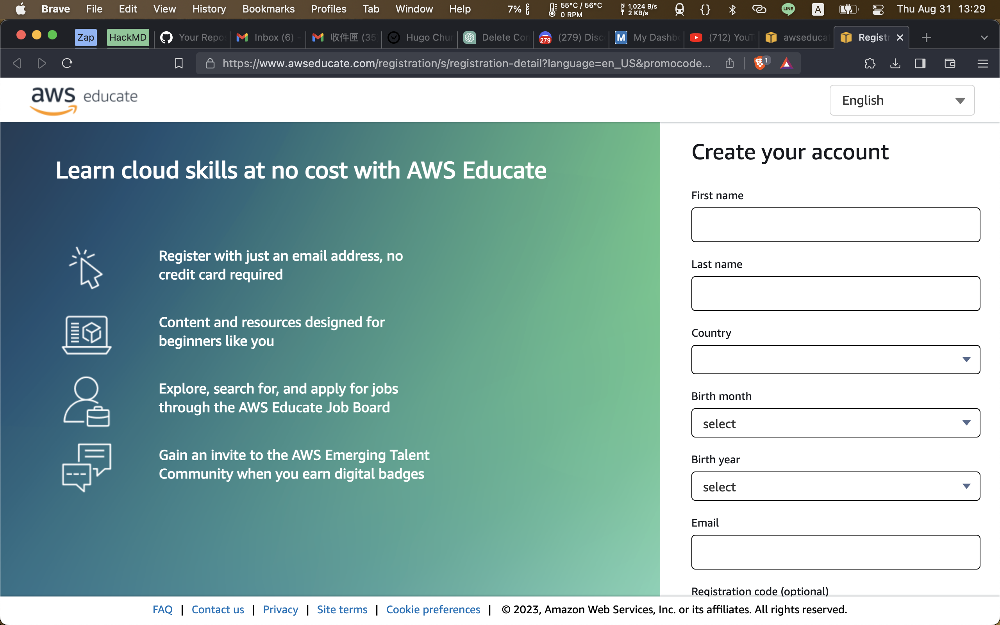
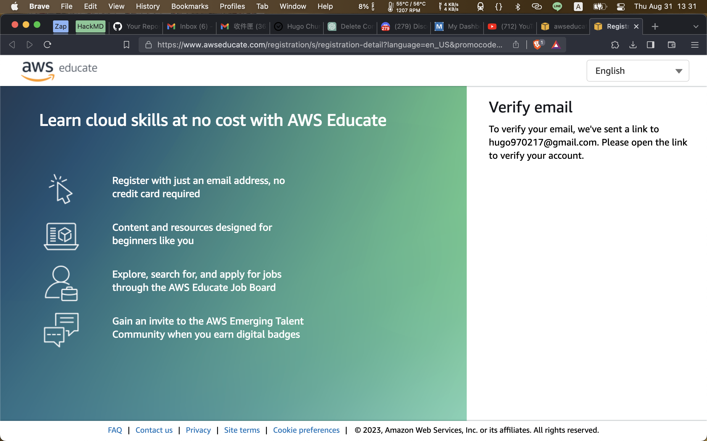
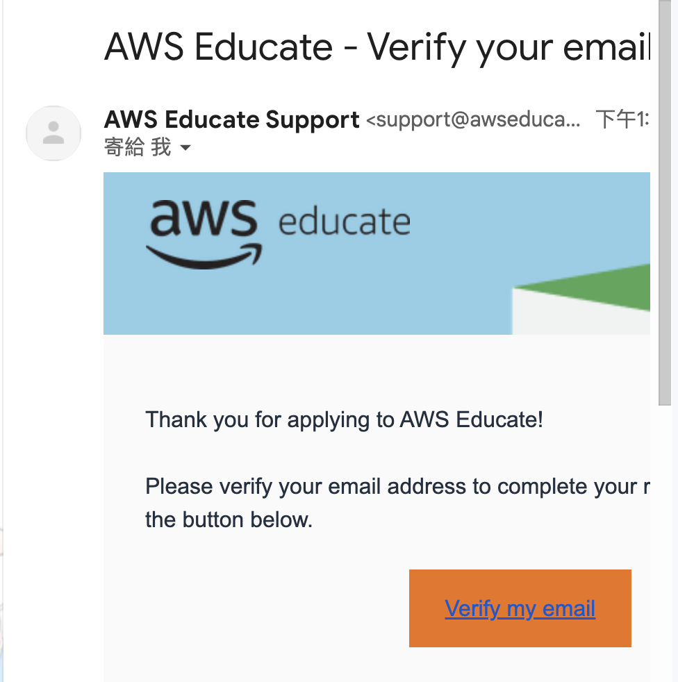
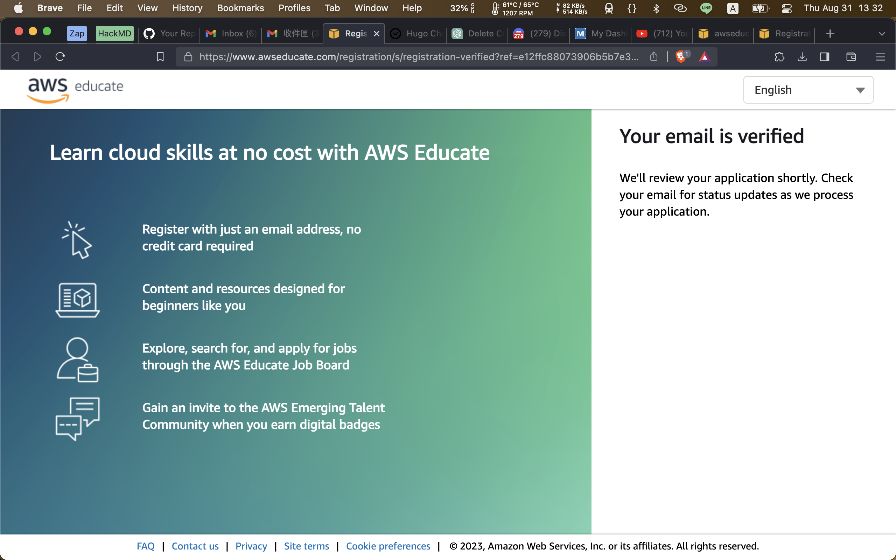
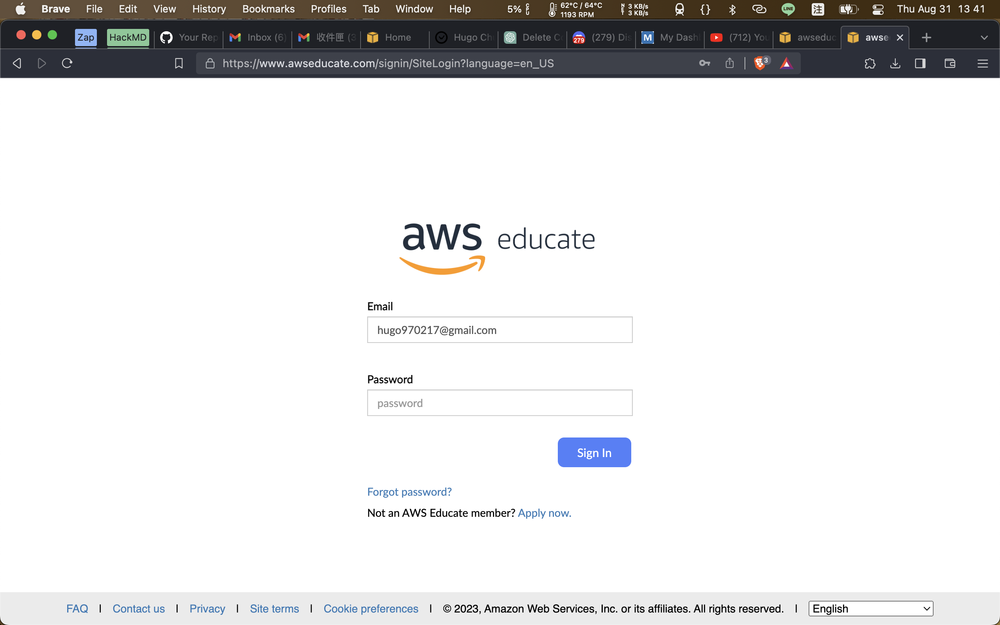

# [Inforcement] AWS Educate Sign Up User Experience

Descriptions
---
When using the registration page, there is no provision for setting a password. Upon completing the registration details, users are immediately directed to the email verification screen. Following verification, the subsequent page restricts any other actions and does not offer a direct path to the AWS Educate Platform.

To log in, users are required to return to the original website. However, due to the absence of password setup during the initial registration, logging in is not feasible. The current solution entails clicking on **Forgot password?** during the next login after registration. This process allows for resetting the password and subsequently gaining access to the platform.

How to reproduce and screenshots.
---
| Screenshots | Details |
|:-:|:-:|
| | The login interface does not indicate password setup. |
| | Requests email verification. |
| | Email verification message. |
| | After successful verification, redirection to AWS Educate Platform prevents further actions. |
| | Re-entry to [AWS Educate Login Page](https://www.awseducate.com/signin/SiteLogin?language=en_US) is necessary to access the AWS Educate platform. However, the absence of password setup during initial registration prevents logging in. |

Expections
---
Due to the current complexity of the registration process and the lack of user engagement within our platform, we are considering the following solutions:
1. Enabling users to set up a password during the registration process.
2. Providing users with an opportunity to reset their password after email verification.

Currently, after email verification, users are not guided on how to return to the platform, and the absence of password setup prevents user login. This situation could lead to users being unable to experience the full benefits of our outstanding product.

How to reach out to me?
---
- Email: hugo970217@gmail.com